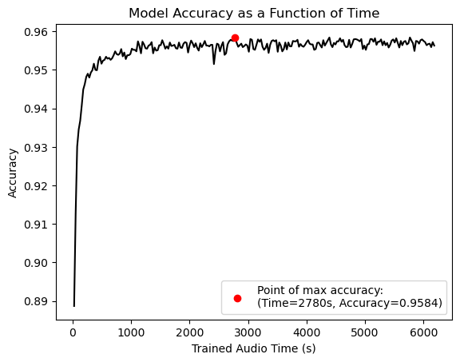
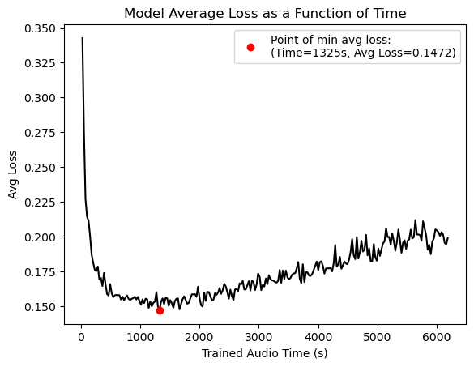
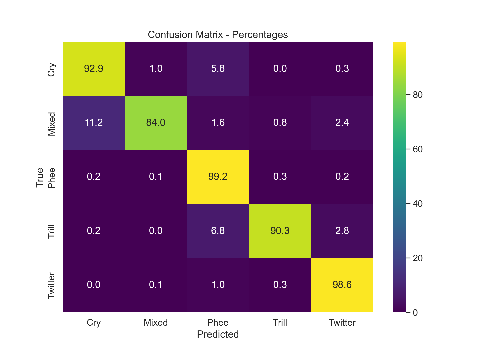

# Marmoset Call Classification

Classification of marmoset calls using [tweetynet](https://github.com/yardencsGitHub/tweetynet.git). Check out more at [poster](performance_pics/poster.pdf).

Development of the [MarmosetCallClassification](https://github.com/kalleknast/MarmosetCallClassification.git) work.

The pipeline converts audio to spectrograms, generates predictions with the trained neural network and displays spectrograms with the classifications (optional).

## Performance

Performance of the TweetyNet model trained on marmoset vocalizations*:

| Accuracy | Loss | Segment Error Rate |
|---------|------|-----|
| 0.9584 | 0.1472 | 0.2821 |

* Recorded and labeled by Daniel Y. Takahashi and colleauges. See [Takahashi, D. Y., Fenley, A. R., Teramoto, Y., Narayanan, D. Z., Borjon, J. I., Holmes, P., & Ghazanfar, A. A. (2015). The developmental dynamics of marmoset monkey vocal production. Science, 349(6249), 734-738.](https://doi.org/10.1126/science.aab1058) for details

### Training metrics for validation data

Accuracy of the model as a function of the time of trained audios.


Average error of the model as a function of the time of trained audios.


Normalized confusion matrix of the model on validation data calls.


## Installation

> Install [vak](https://vak.readthedocs.io/en/latest/get_started/installation.html) version >= 0.8.

## Use

```python3 predict.py <data_dir> <out_dir> --plot_spec```

* You don't need to modify predict.toml!

> ```data_dir```: Directory containing the data to predict on (wav audio files).

> ```out_dir```: Directory to save the outputs (preprocessed spectrograms and predictions). Two folders will be created: results to store the predictions (```predictions.csv``` and ```spect_plots``` for the spectrograms with the classifications if ```--plot_spec```) and data to store the preprocessed data that will serve as input for tweetynet.

> ```--plot_spec```: Add to plot the spectrograms.
